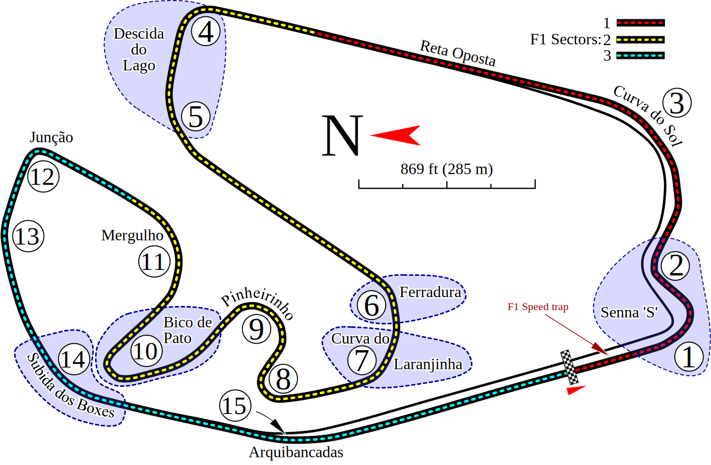

# Windy Seas

> [!NOTE]
> Legenda
>
> - Código: _Itálico_
> - Arte: **Negrito**
> - Som: **_Negrito Itálico_**

## Jogo

Começa o jogo com uma **tela** de _Loading_ para o **menu inicial**, sendo esse composto pelos **botões jogar e sair do jogo** possuindo **_música de fundo_**. Ao clicar em jogar, **uma tela de Loading** levará o jogador para a próxima cena, que consiste do primeiro nível do jogo: Um **cais** atrás do jogador e um percurso logo a frente, onde o jogador (representado pelo **modelo do barco**) irá _coletar_ um número de **barris** dispostos no percurso. Ao um nível uma **tela de resultados** vai aparecer em conjunto com a **_música do menu_** informando que o player finalizou, possibilitando o player de reiniciar ou avança para a próxima fase. Os níveis seguintes vão introduzir novas mecânicas como obstáculos para desafiar as habilidades do jogador.

| Arte | Status | Programação | Status | Sons | Status |
| ---------------------------------------- | :----: | ----------------------------------------------- | :----: | ---------------------------------------- | :----: |
| Tela de Loading                          |   ✅   | Loading entre cenas                             |   ✅   | Sons de UI                               |   ✅   |
| Fonte                                    |   ✅   | Controles do Barco                              |   ✅   | Música de fundo tela inicial             |   ✅   |
| Backdrop Menu Inicial                    |   ✅   | Dano do Barco                                   |   ✅   | Música Tela Resultados                   |   ✅   |
| Botões Tela inicial                      |   ✅   | Quantidade de Barris Coletados                  |   ✅   |                                          |        |
| Botões de Controles do Barco             |   ✅   | Completar a missão atual                        |   ✅   |                                          |        |
| Voltar para Menu Inicial                 |   ✅   | Interface de Controle do Barco                  |   ✅   |                                          |        |
| Modelo do Barco                          |   ✅   | Interface de Pausa                              |   ✅   |                                          |        |
| Ícones                                   |   ✅   | Física e Colisões                               |   ✅   |                                          |        |
| Botão Próximo Nível                      |   ✅   | Vida do Barco                                   |   ✅   |                                          |        |
| Botão Refazer Fase                       |   ✅   |                                                 |        |                                          |        |
| Voltar para Menu Inicial                 |   ✅   |                                                 |        |                                          |        |

## Cancelados

- Dialogos
- Carregamento / Descarregamento de carga
- Tutorial de controles
- Inimigos

## Licensas

- Assets - Modelos 3D e Texturas:
  - ["PirateKit by Kenney"](https://kenney.nl/assets/pirate-kit) CC0
  - ["UI Pack Adventure by Kenney"](https://kenney.nl/assets/ui-pack-adventure) CC0
  - ["Input Prompts by Kenney"](https://kenney.nl/assets/input-prompts) CC0
  - ["Fonts by Kenney"](https://kenney.nl/assets/kenney-fonts) CC0
  - ["Watercraft Kit by Kenney"](https://kenney.nl/assets/watercraft-kit) CC0
- Assets - Sons:
  - ["Interface Sounds by Kenney"](https://kenney.nl/assets/interface-sounds) CC0
  - Menu Principal ["Curry Us - Dan Knoflicek](https://opengameart.org/content/curry-us) CC-BY 3.0
  - Level 1 ["Courage Rescue - Dan Knoflickek](https://opengameart.org/content/courage-rescue) CC-BY 4.0
  - Créditos ["A Floater - Dan Knoflickek"](https://opengameart.org/content/a-floater) CC-BY 4.0
- Código:
  - ["Phantom Camera"](https://phantom-camera.dev/) MIT
  - Esse jogo MIT

## Inspiração Level Design

- [Rational Approach to Racing Game Track Design](https://www.gamedeveloper.com/design/a-rational-approach-to-racing-game-track-design)

