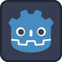

# Windy Seas

	

> INFO: Legenda
>
> - Código = **Negrito**
> - Arte = _Itálico_
> - Som = **_Negrito Itálico_**

## Narrativa

O jogador aceita um trabalho como cargueiro para quitar dívidas de jogo. Agora deve interpretar as insanas instruções de seus clientes para fazer as entregas da forma correta.

## Jogo

Começa o jogo com a _tela_ de **Loading** para o **menu inicial**, sendo esse composto pelos _botões jogar_ e _sair do jogo_ possuindo **_música de fundo_**, ao clicar em jogar uma tela de **Loading** levará o jogador para a próxima cena que consiste de uma _ilha_ e um _caís_ onde um jogador(representado pelo _modelo do barco_) receberá instruções sobre como **dirigir o barco** por meio de **diálogos** em _balões de fala_ e com a "ajuda" de instruções mal contadas deve adivinhar a ilha em que deve fazer sua primeira entrega.

Na interface do jogo haverá um _ícone de papel_ que ao **clicar abrirá uma tela com as instruções**.

A partir daí o jogador se encontra livre para explorar o _arquipélago_ em busca da ilha correta para a primeira entrega. _Cada ilha terá características únicas_ que devem ser observadas pelo jogador para fazer uma entrega bem sucedida, caso o jogador entregue em uma ilha errada o mesmo pode voltar com o pacote para o caís original e **trocar o pacote que está carregando** ou tentar em outra ilha com o mesmo pacote.

## Documentação

Nossa documentação pode ser encontrada aqui [[docs/README]]

## Assets

- [ ] Loading
- [ ] UI
- [x] Ilhas
- [x] Barco
- [ ] Diálogos
- [ ] Ícones

## Gameplay / Código

- [ ] Loading entre cenas
- [x] Controles do Barco
- [ ] Diálogos (dialogic2)
- [ ] Missões de entrega
- [ ] UI funcional
- [ ] Física e Colisões

## Sons

- [ ] Sons de UI
- [ ] Música de fundo

## Licensas

- Assets - Modelos 3D e Texturas:
  - ["PirateKit by Kenney"](https://kenney.nl/assets/pirate-kit) CC0
  - ["UI Pack Adventure by Kenney"](https://kenney.nl/assets/ui-pack-adventure) CC0
  - ["Input Prompts by Kenney"](https://kenney.nl/assets/input-prompts) CC0
  - ["Fonts by Kenney"](https://kenney.nl/assets/kenney-fonts) CC0
- Assets - Sons:
  - ["Interface Sounds by Kenney"](https://kenney.nl/assets/interface-sounds) CC0
- Código:
  - ["BeeHave"](https://bitbra.in/beehave/#/) MIT
  - ["Dialogic"](https://github.com/dialogic-godot/dialogic?tab=readme-ov-file#dialogic-2) MIT
  - ["Phantom Camera"](https://phantom-camera.dev/) MIT
  - Esse jogo MIT
